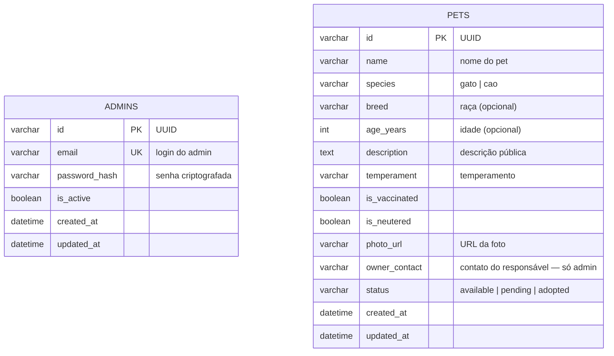
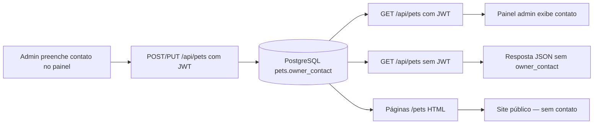

# Modelo de Dados (Banco)

O banco PostgreSQL (`adocao_gatos`) possui duas tabelas principais: **pets** e **admins**.

## Fluxograma (ER)



## Visibilidade dos campos

| Campo | Site público | API pública (`GET /api/pets`) | Admin autenticado |
|-------|--------------|--------------------------------|-------------------|
| name, species, breed, age, description, temperament | Sim | Sim | Sim |
| is_vaccinated, is_neutered, photo_url, status | Sim | Sim | Sim |
| **owner_contact** | **Não** | **Não** | **Sim** |

O campo `owner_contact` guarda o telefone (ou outro contato) de quem colocou o pet para adoção. Ele **nunca** aparece nas páginas HTML do site nem nas respostas da API sem JWT válido.

## SQL da tabela `pets`

```sql
CREATE TABLE pets (
    id VARCHAR(36) PRIMARY KEY,
    name VARCHAR(255) NOT NULL,
    species VARCHAR(50) NOT NULL,
    breed VARCHAR(255),
    age_years INTEGER,
    description TEXT,
    temperament VARCHAR(255),
    is_vaccinated BOOLEAN DEFAULT FALSE,
    is_neutered BOOLEAN DEFAULT FALSE,
    photo_url VARCHAR(500),
    owner_contact VARCHAR(50),
    status VARCHAR(50) NOT NULL DEFAULT 'available',
    created_at TIMESTAMP NOT NULL DEFAULT NOW(),
    updated_at TIMESTAMP
);

CREATE INDEX idx_pets_status ON pets(status);
CREATE INDEX idx_pets_name ON pets(name);
```

## Atualizar banco existente (produção)

Se o projeto já estava no ar antes desta alteração, rode:

```bash
python manage_db.py upgrade
```

Ou direto no PostgreSQL / Cloud SQL:

```sql
ALTER TABLE pets ADD COLUMN IF NOT EXISTS owner_contact VARCHAR(50);
```

## Fluxo de dados — contato do responsável


