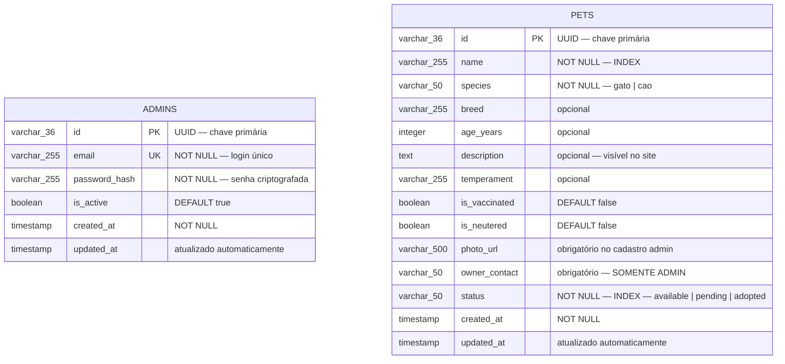
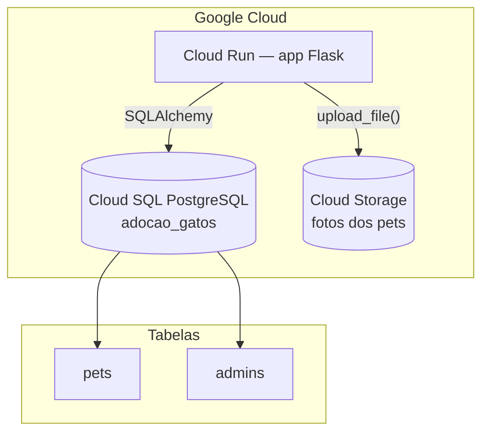
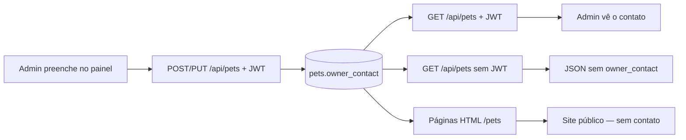

# Modelo de Dados (Banco)

Banco PostgreSQL: **`adocao_gatos`** (Cloud SQL)  
Stack: Flask + SQLAlchemy

---

## Diagrama ER (Mermaid)

Copie o bloco abaixo em [Mermaid Live Editor](https://mermaid.live), GitLab, GitHub ou Notion:



> **Nota:** `pets` e `admins` são tabelas **independentes** (sem foreign key entre elas).

---

## Visão geral do banco (Mermaid)



---

## Visibilidade do campo `owner_contact` (Mermaid)



---

## Visibilidade dos campos

| Campo | Site público | API pública | Admin autenticado |
|-------|:------------:|:-----------:|:-----------------:|
| name, species, breed, age_years, description, temperament | Sim | Sim | Sim |
| is_vaccinated, is_neutered, photo_url, status | Sim | Sim | Sim |
| **owner_contact** | **Não** | **Não** | **Sim** |

---

## SQL — tabela `pets`

```sql
CREATE TABLE pets (
    id              VARCHAR(36)  PRIMARY KEY,
    name            VARCHAR(255) NOT NULL,
    species         VARCHAR(50)  NOT NULL,
    breed           VARCHAR(255),
    age_years       INTEGER,
    description     TEXT,
    temperament     VARCHAR(255),
    is_vaccinated   BOOLEAN      DEFAULT FALSE,
    is_neutered     BOOLEAN      DEFAULT FALSE,
    photo_url       VARCHAR(500),
    owner_contact   VARCHAR(50),
    status          VARCHAR(50)  NOT NULL DEFAULT 'available',
    created_at      TIMESTAMP    NOT NULL DEFAULT NOW(),
    updated_at      TIMESTAMP
);

CREATE INDEX idx_pets_status ON pets(status);
CREATE INDEX idx_pets_name   ON pets(name);
```

## SQL — tabela `admins`

```sql
CREATE TABLE admins (
    id            VARCHAR(36)  PRIMARY KEY,
    email         VARCHAR(255) NOT NULL UNIQUE,
    password_hash VARCHAR(255) NOT NULL,
    is_active     BOOLEAN      DEFAULT TRUE,
    created_at    TIMESTAMP    NOT NULL DEFAULT NOW(),
    updated_at    TIMESTAMP
);

CREATE UNIQUE INDEX idx_admins_email ON admins(email);
```

---

## Migração — adicionar `owner_contact`

```bash
python manage_db.py upgrade
```

```sql
ALTER TABLE pets ADD COLUMN IF NOT EXISTS owner_contact VARCHAR(50);
```
